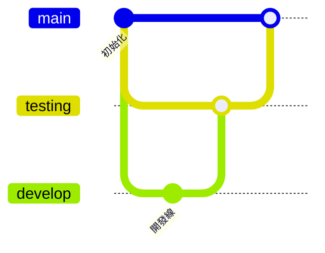

# Git Flow

## Init

```bash
git init
# 測試部署分支
git branch testing
# 開發分支
git branch develop
```



## hasky

```bash
pnpm i -D husky
pnpm dlx husky-init
```

.husky/pre-commit

```bash
#!/usr/bin/env sh
. "$(dirname -- "$0")/_/husky.sh"

#npm test
pmpm build
```
