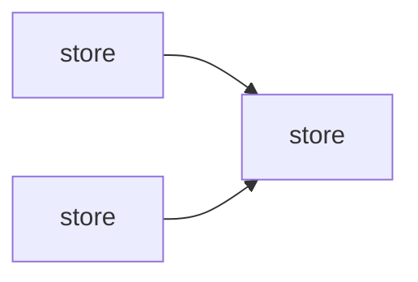
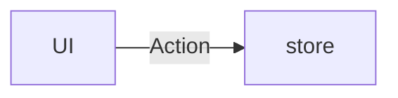
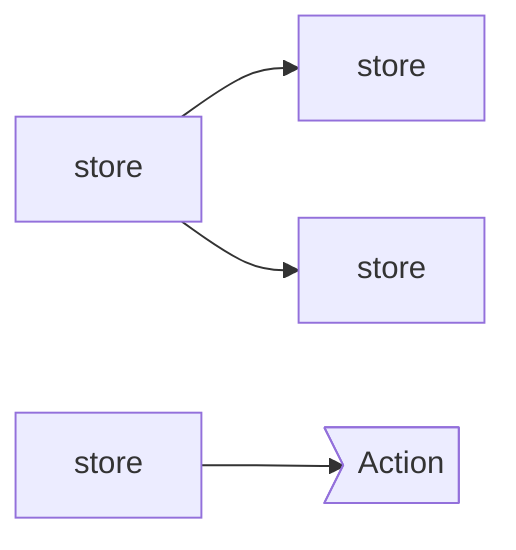
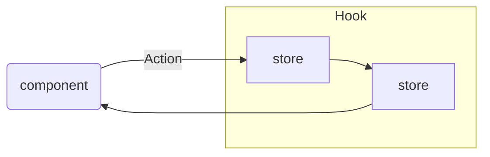
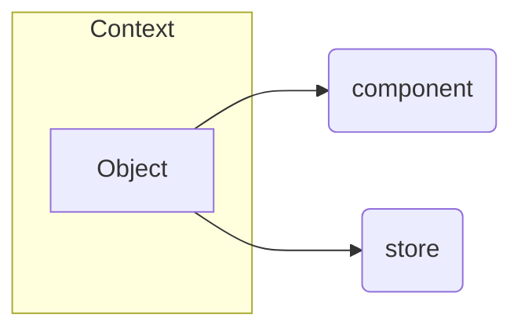
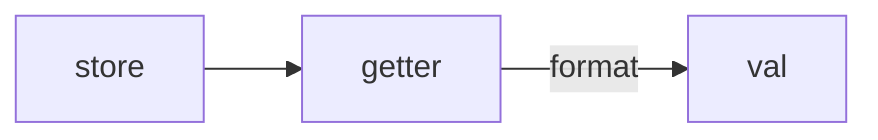

# 其境描述說明

## Store

單一狀態改變

```mermaid
graph LR;
storeA[store]-->storeB[store];
storeC[store]-->storeB[store];
```

## Action

事件改變狀態

```mermaid
graph LR;
UI[UI]--Action-->store[store];
```

## Controller

狀態衍生出的副作用

```mermaid
graph LR;
storeA[store]-->storeB[store];
storeA[store]-->storeC[store];
storeD[store]-->Action>Action]
```

## Hook

組件內的狀態邏輯封裝

```mermaid
graph LR;
component(component)--Action--->storeA[store]
storeB[store]-->component(component)
subgraph "Hook"
storeA[store]-->
storeB[store]
end
```

## Context

全域物件

```mermaid
graph LR;
subgraph "Context"
    Object
end
Object-->component(component)
Object-->store(store)
```

## Getter

取值 + 邏輯計算

```mermaid
graph LR;
store -->getter--format--> val
```
